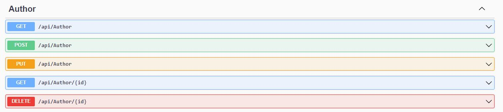

# Bootcamp Backend II - [Relacional] Laboratorio Modulo 2 - Api Rest


Para esta práctica se nos solicita:

- Levantar una base de datos en SQL sobre Docker.
- Crear una API REST para el siguiente modelo de base de datos.


## Requerimientos Previos

#### 1. Instalamos SQL Server en Docker  

- Crea un contenedor  Linux
> docker run -e 'ACCEPT_EULA=Y' -e 'MSSQL_SA_PASSWORD=Lem0nCode!' -p 1433:1433 --name sqlserver2019 -d mcr.microsoft.com/mssql/server:2019-latest
- Crea un contenedor  Windows
> docker run -e "ACCEPT_EULA=Y" -e "MSSQL_SA_PASSWORD=Lem0nCode!" -p 1433:1433 --name sqlserver2019 -d mcr.microsoft.com/mssql/server:2019-latest


#### 2. Instalamos Entity Fremwork  

> dotnet tool install --global dotnet-ef

## Solucion en Visual Studio 2022
Hemos realizado una solucion llamada Library, dentro de la cual existen dos proyectos:
> EFLibrary --> El cual es un proyecto de pruebas para conectar la base de datos crear tablas y gurdar datos.
> LibraryApi --> Esta es la API de la practica

#### 3. Trabajaremos con Visual Studio 2022 y .NET 7.
> <TargetFramework>net7.0</TargetFramework>

#### 4. Instalamos los siguientes paquetes NuGet T
```

  <ItemGroup>
    <PackageReference Include="Microsoft.EntityFrameworkCore.Design" Version="7.0.16">
      <PrivateAssets>all</PrivateAssets>
      <IncludeAssets>runtime; build; native; contentfiles; analyzers; buildtransitive</IncludeAssets>
    </PackageReference>
    <PackageReference Include="Microsoft.EntityFrameworkCore.SqlServer" Version="7.0.16" />
    <PackageReference Include="Newtonsoft.Json" Version="13.0.3" />
    <PackageReference Include="Swashbuckle.AspNetCore" Version="6.4.0" />
  </ItemGroup>
```

#### Tedremos dos Entity Models
> Book y Author

## Tendremos dos Repositorios
> AuthorRepositoryMock.cs y AuthorRepositorySQL.cs

Segun inyectemos uno u otro trabajaremos con la BBDD (en SQL Server) o con datos Mosk (en un JSON en local)

#### EndPoints
Como hemos instalado Swagger podremos probar y ademas ver las especifocaciones de la API facilmente. 
En todo caso los end points serán:
>GET  http://localhost:5290/api/Author
